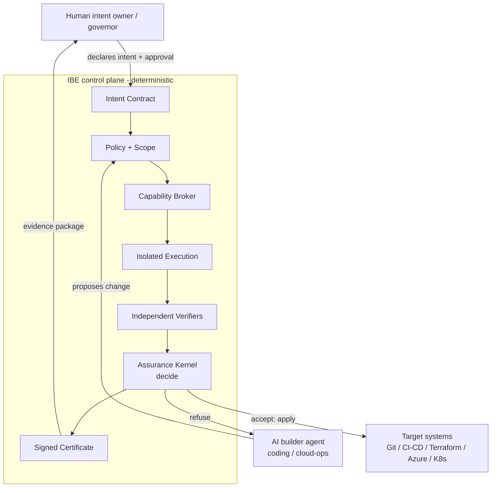
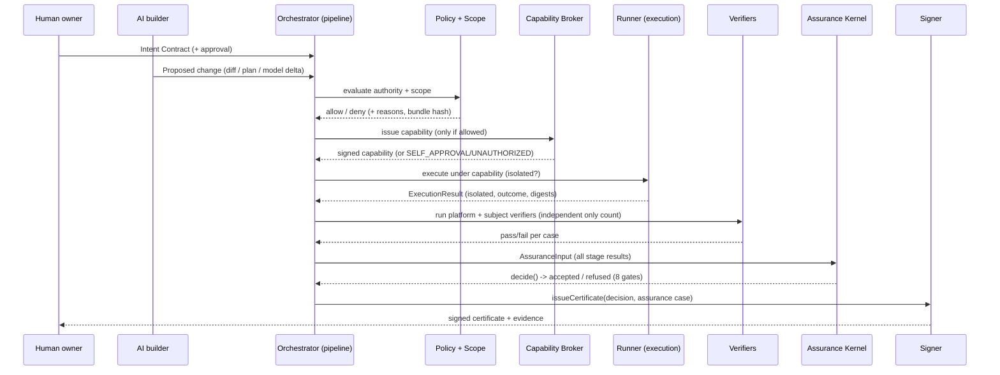

# Architecture

IBE (Intent-Bound Execution) is an **AI Engineering Assurance Platform**: an independent,
deterministic control plane that decides whether an AI-generated software or
infrastructure change has *earned the right to proceed*. It is not an AI coding agent. It
sits between AI builders and the systems they want to change and enforces one rule:

> **Authorized AND Model-traceable AND Within-scope AND Policy-compliant AND
> Causally-valid AND Independently-verified AND Evidence-complete AND Recoverable OR
> REFUSE**

A passing change yields a signed **Engineering Assurance Certificate** backed by an
evidence package; a failing change yields an evidence-backed **refusal certificate**
naming exactly which gate failed. No LLM participates in the decision.

## Two governing principles

**Deterministic kernel.** The final accept/refuse decision is made by
`packages/assurance/kernel.ts` — a pure function (`decide(input)`) over structured
inputs. Every gate is a pure predicate; the same inputs always yield the same decision.
No model, no network, no randomness in the decision path.

**Fail-closed.** Ambiguous, out-of-scope, unsafe, unverifiable, expired, unsigned, or
unauthorized inputs are refused. Expected negative outcomes are returned as `Result` /
`Reason` values (`packages/shared/result.ts`) so a caller cannot forget to handle them;
truly unexpected conditions throw and fail closed at the top level. The kernel also
refuses when execution is inconclusive (timeout / crash / isolation-unavailable), so a
certificate is never issued over an unknown run.

## The enforced chain

Every consequential change flows through this chain, wired end-to-end by
`packages/orchestrator/pipeline.ts` (`runPipeline`) and decided by the kernel:

```
Human Intent → Intent Contract → Authority → Model Traceability → Model Delta
→ Hazard/Invariant Eval → Capability Issuance → Isolated Execution
→ Causal Event Collection → Independent Verification → Provenance
→ Assurance Case → Signed Certificate → Accept / Refuse / Roll Back / Escalate
```

| Stage | Package / function |
|---|---|
| Human Intent (events) | `events` — `EventEmitter.emit('IntentReceived' …)` |
| Intent Contract | `intent` — `LoadedIntent` (validated + hashed upstream) |
| Authority | `policy` — `DeterministicPolicyEngine.evaluate` + `adapters` `analyzeScope` |
| Model Traceability | `model` — `validateComposition` (assume-guarantee) |
| Model Delta | `model` — `computeModelDelta` |
| Hazard / Invariant Eval | `hazards` derivations fed via `policy` + `causal` |
| Capability Issuance | `capabilities` — `CapabilityBroker.issue` |
| Isolated Execution | `execution` — injected runner (`ExecutionResult`) |
| Causal Event Collection | `causal` — `CausalGraph`, `evaluateConformance` |
| Independent Verification | `verification` — `VerifierRegistry.runAll`, `checkIndependence` |
| Provenance | `provenance` — `createEvidence`, `createAttestation` |
| Assurance Case | `assurance` — `buildAssuranceCase` |
| Signed Certificate | `assurance` — `issueCertificate` |
| Accept / Refuse | `assurance` — `decide` (the kernel) |

Authorization short-circuits capability issuance: if authority is denied, no capability
is issued, an `AuthorizationRefused` event is emitted, and the kernel's `authorized` gate
fails. Any single failing gate makes `decide()` return `refused`.

## Package map

| Package | Purpose |
|---|---|
| `packages/shared` | Canonical JSON + SHA-256 hashing, hardened file/structured-input loading, `Result`/`Reason`, injectable clock, secret-redacting logger |
| `packages/intent` | Intent Contract v2 (Zod schema), completeness checks, v1→v2 migration, load+hash |
| `packages/model` | MBSE metamodel, traceability/impact graph, hashed model delta, assume-guarantee, information-flow, SysML v2 adapter seam |
| `packages/hazards` | STPA registry, IBE's own 8-hazard self-model, derivation of policies/invariants/patterns |
| `packages/policy` | Deterministic Policy Decision Point, bundle hashing, Rego mirror + OPA adapter |
| `packages/identity` | Ed25519 identities, roles, `LocalIdentityProvider`, SPIFFE seam |
| `packages/capabilities` | Signed, bound, revocable, single-use capability broker |
| `packages/execution` | Runner abstraction; Docker runner + honestly-labeled local fallback; workspace path-safety |
| `packages/adapters` | Git unified-diff parse, ts-morph AST symbol diff, scope enforcement + protected globs, Terraform plan analysis |
| `packages/events` | Causal event envelope, append-only store, OpenTelemetry export adapter |
| `packages/causal` | Causal graph (cycle/missing-parent/ordering/ancestry) + required/forbidden/recovery pattern evaluation |
| `packages/verification` | Independent verifier framework + platform-authored verifiers |
| `packages/provenance` | in-toto/SLSA-style attestation, evidence freshness/invalidation |
| `packages/assurance` | The governing-rule kernel, assurance cases, signed certificates |
| `packages/oscal` | OSCAL subset export (NIST SP 800-171 mapping) |
| `packages/formal` | Explicit-state checker mirroring the TLA+ specs (the CI gate) |
| `packages/orchestrator` | End-to-end pipeline wiring the full chain |
| `packages/cli` | `ibe` command-line interface |
| `packages/api` | Dependency-free REST control-plane service |

## System context



## Intent-to-certificate sequence


