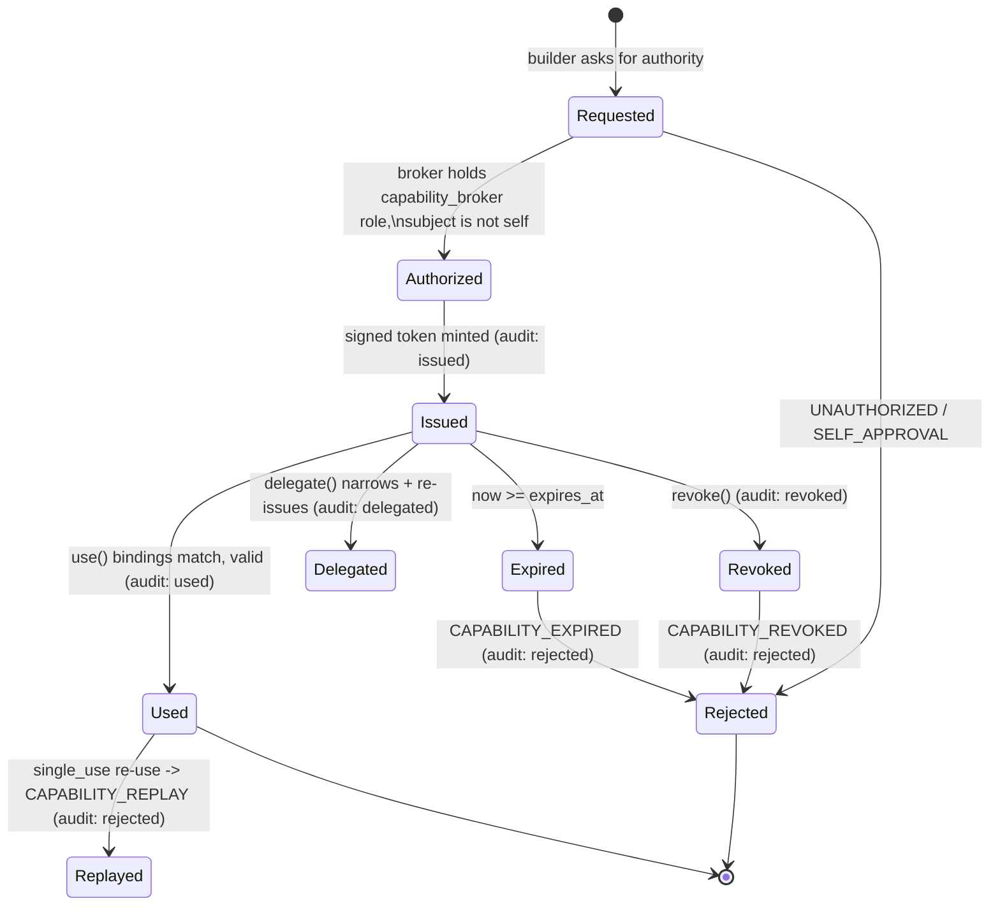

# Capabilities

Authority in IBE is a **signed, least-privilege, revocable capability token** — never
an ambient RBAC role. A builder that wants to change a file, apply a plan, or promote
an artifact must present a capability that was issued by an independent broker, is
bound to a specific intent/action/resource/environment, has not expired, has not been
revoked, and (if single-use) has not already been consumed.

Source: `packages/capabilities/token.ts` (`Capability`), `packages/capabilities/broker.ts`
(`CapabilityBroker`). The lifecycle safety properties are proven in `packages/formal`
and `formal/tla/Capability.tla` — see [formal-methods.md](./formal-methods.md).

## Capability token fields

`Capability` (from `token.ts`). Every field:

| Field | Type | Purpose |
|---|---|---|
| `id` | `string` | Unique capability id (broker sequence, prefix `CAP`) |
| `intent_id` | `string` | Intent this capability derives from |
| `intent_hash` | `Digest` | Canonical hash binding to the exact intent |
| `actor_id` | `string` | The authenticated actor/workload the capability is bound to |
| `action` | `string` | The single authorized action |
| `resource` | `string` | The single authorized resource |
| `environment` | `string` | Target environment |
| `model_version` | `string` | System-model version the authority is scoped to |
| `artifact_digest?` | `Digest` | Optional binding to a specific plan/built artifact |
| `issued_at` | `string` | ISO timestamp |
| `expires_at` | `string` | ISO timestamp (issue time + TTL) |
| `single_use` | `boolean` | If true, may be consumed at most once |
| `delegatable` | `boolean` | If true, may be narrowed and re-issued to another actor |
| `delegated_from?` | `string` | Parent capability id when delegated |
| `issuer_id` | `string` | Broker actor id |
| `issuer_key_id` | `string` | Broker signing key id |
| `nonce` | `string` | Anti-replay nonce |
| `signature` | `string` | Ed25519 signature (base64) over the canonical payload |

**Bindings** are the fields checked at use time: `actor_id`, `action`, `resource`,
`environment`, `model_version`, and (when present) `artifact_digest`. The signed bytes
are `canonicalStringify(capabilitySigningPayload(cap))` — i.e. every field *except*
`signature`.

## Lifecycle

IBE does not store an explicit `Requested → Authorized → Issued → …` enum; instead the
lifecycle is enforced inline in `issue()`/`use()` and surfaced through the broker's
`AuditEvent.type` values (`issued | used | revoked | rejected | delegated`) plus the
internal `revoked`, `consumed` sets and time-based expiry.

## Broker operations

`CapabilityBroker(idp, brokerActorId, clock = systemClock, idGen?)`.

### `issue(req: IssueRequest): Result<Capability, Reason>`
Fail-closed checks, in order:
1. Broker must hold the `capability_broker` role, else `UNAUTHORIZED`.
2. If the subject holds the `builder` role **and** is the broker itself → `SELF_APPROVAL`
   ("a builder cannot issue its own capability").
3. If the subject is the broker itself → `SELF_APPROVAL` ("broker cannot issue a capability to itself").

On success it sets `issued_at`, `expires_at = now + ttlSeconds*1000`, a fresh `nonce`,
`issuer_id`, `issuer_key_id`, signs the canonical payload, stores the token, and records
an `issued` audit event.

### `validate(cap, expect: UseExpectation): Result<true, Reason>`
Non-consuming check. Five checks with precise reason codes:

| Check | Reason on failure |
|---|---|
| Signature authenticity | `SIGNATURE_INVALID` |
| Revocation | `CAPABILITY_REVOKED` |
| Expiry (`now >= Date.parse(expires_at)`, no clock-skew leniency) | `CAPABILITY_EXPIRED` |
| Actor / action / resource / environment / model_version binding | `CAPABILITY_INVALID` |
| Artifact digest mismatch | `PROVENANCE_MISMATCH` |
| Single-use already consumed | `CAPABILITY_REPLAY` |

### `use(cap, expect): Result<true, Reason>`
Validate **and** consume. On failure records a `rejected` audit event (with `code`). On
success, if `single_use`, adds the id to `consumed` and records a `used` audit event.

### `revoke(capabilityId, why): void`
Adds the id to the `revoked` set and records a `revoked` audit event. Subsequent
`validate`/`use` return `CAPABILITY_REVOKED`.

### `delegate(parent, toActorId, narrow?): Result<Capability, Reason>`
- Rejects if `!parent.delegatable` (`CAPABILITY_INVALID`).
- Computes remaining TTL; rejects if `<= 0` (`CAPABILITY_EXPIRED`).
- Child TTL = `min(narrow.ttlSeconds ?? remaining, remaining)` — **can only narrow**.
- Copies the parent's action/resource/environment/model/artifact bindings.
- Sets `delegatable: false` — **delegation is not transitive by default**.
- Records a `delegated` audit event referencing the parent id.

## The five invariants (proven in TLA+)

The broker's guarantees are mechanically checked against `formal/tla/Capability.tla`
(authoritative) and its TypeScript mirror `packages/formal/capability-spec.ts` (the CI
gate via `npm run formal`):

1. A **revoked** capability can never be used.
2. An **expired** capability can never be used.
3. A capability cannot authorize an action **outside its bound intent**.
4. A **single-use** capability cannot be used twice (replay protection).
5. A **builder cannot issue its own capability**.

In the TLA+/TS state machine, invariants (1) and (2) collapse into the single
`Inv_NoUseWhileInvalid` / `usedWhileInvalid = FALSE` invariant; (3) is
`Inv_BoundToIntent`, (4) is `Inv_SingleUse`, (5) is `Inv_NotBuilderIssued`.

## Audit trail

Every broker decision appends an immutable `AuditEvent` (`issued | used | revoked |
rejected | delegated`) retrievable via `auditLog()`, giving a complete, replayable
record of who was granted what authority and when it was consumed or refused.
