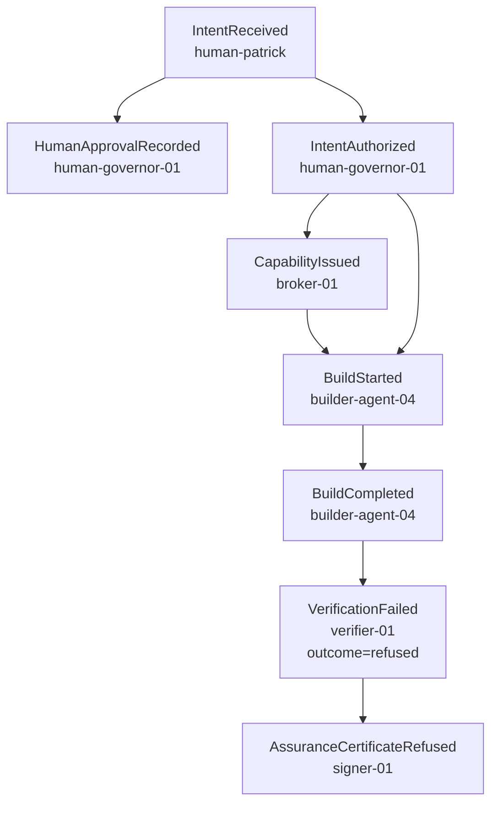

# Causal Events

IBE records what actually happened as a directed acyclic graph of typed, causally-linked
events. The causal trace is one of the eight assurance gates (`causally-valid`): the
kernel refuses a change whose event trace is structurally unsound or violates a required /
forbidden / recovery pattern.

Source: `packages/events/envelope.ts`, `store.ts`, `otel.ts`; `packages/causal/graph.ts`,
`patterns.ts`.

## Event envelope

`EventEnvelope` is a `.strict()` Zod schema (unknown keys rejected). `EventOutcome` is one
of `success | failure | pending | refused`.

| Field | Type | Purpose |
|---|---|---|
| `event_id` | StableId | Stable unique event id |
| `event_type` | string (1–80) | Event name (e.g. `CapabilityIssued`) |
| `occurred_at` | ISO datetime w/ offset | Temporal-ordering basis |
| `actor_id` | StableId | Who/what produced the event |
| `intent_id` | StableId | The intent this event belongs to |
| `action_id?` | StableId | Optional linked action |
| `capability_id?` | StableId | Optional capability it ran under |
| `model_version?` | string | Optional model version |
| `parent_event_ids` | StableId[] (default []) | Explicit causal parent links (the DAG edges) |
| `artifact_digest?` | string | Optional artifact digest |
| `evidence_refs` | StableId[] (default []) | References to evidence |
| `outcome` | EventOutcome | success / failure / pending / refused |
| `attributes` | record (default {}) | Free-form typed attributes — must never carry secrets |

`parseEvent(raw)` validates untrusted input. Events are produced deterministically by
`EventEmitter.emit` (assigns `event_id` from a `SequentialIdGenerator('EV')` and
`occurred_at` from the injectable `Clock`).

## Event store

`EventStore` is an in-memory, append-only store. `append(event)` re-validates and rejects
duplicate ids; `all()`, `get(id)`, and `forIntent(intentId)` read it back. There is no
persistent backend today (see [roadmap.md](./roadmap.md)).

## Causal graph checks

`CausalGraph` is built from `Event[]` (guarded by `MAX_EVENTS = 100_000`). `validate()`
returns `Reason[]` (all with code `CAUSAL_INVALID`) covering three structural checks:

1. **Missing parent** — a `parent_event_ids` entry not present in the trace.
2. **Temporal ordering** — a parent whose `occurred_at` is strictly after the child's (a
   cause cannot occur after its effect).
3. **Cycle** — three-color iterative DFS over the child adjacency; a back-edge to a GRAY
   node is a causal cycle. A causal graph must be acyclic.

Ancestry queries: `ancestors(id)`, `descendants(id)`, `hasAncestor(id, type)`,
`hasDescendantType(id, types)` — these power the pattern grammar below.

## Pattern grammar

Patterns are parsed from intent / hazard strings by `parsePattern(spec)` and evaluated
against a `CausalGraph`.

| Form | Meaning | Kind |
|---|---|---|
| `A->B->C` | Required causal sequence — each stage causally after the prior | `sequence` |
| `T~>(A\|B)` | Recovery obligation — every `T` must causally lead to an `A` or a `B` | `recovery` |
| `NamedForbidden` | A named entry in `FORBIDDEN_CATALOG` | catalog lookup |
| bare name | "no event of this type" | `forbidden-type` |

- `evaluateRequired` → `REQUIRED_PATTERN_MISSING` when a required sequence / event / recovery is not satisfied.
- `evaluateForbidden` → `FORBIDDEN_EVENT_PATTERN` when a forbidden type/sequence/without-prior condition holds.
- `evaluateRecovery` → `RECOVERY_OBLIGATION_UNMET` when a trigger has no satisfying descendant.
- `evaluateConformance(graph, required, forbidden, recovery)` aggregates structural +
  required + forbidden + recovery into a `CausalConformance` (`conformant` iff all clean).

### Named forbidden catalog

`FORBIDDEN_CATALOG` (`packages/causal/patterns.ts`):

| Name | Kind | Condition |
|---|---|---|
| `ProductionChangeWithoutApproval` | without-prior | `ProductionChanged` lacking a causally-prior `IntentAuthorized`, `HumanApprovalRecorded`, and `VerificationPassed` |
| `PromotionBeforeVerification` | without-prior | `ProductionPromoted` lacking a prior `VerificationPassed` |
| `UnauthorizedSecretRead` | forbidden-type | Any `UnauthorizedSecretRead` event |
| `RevokedCapabilityUsed` | forbidden-type | Any `RevokedCapabilityUsed` event |
| `CapabilityExceedsIntent` | forbidden-type | Any `CapabilityExceedsIntent` event |
| `BuilderModifiedOwnPolicy` | forbidden-type | Any `BuilderModifiedOwnPolicy` event |

These names are exactly the forbidden patterns derived from the STPA self-hazard model
(see [threat-model.md](./threat-model.md)).

## OpenTelemetry adapter

`toOtelSpans(events, traceSeed?)` (`events/otel.ts`) maps IBE causal events to
OTel-compatible `OtelSpan`s: one shared 128-bit `traceId` (derived from the intent id),
per-event 64-bit `spanId` = `sha256(event_id)`, `parentSpanId` from the first parent,
`startTimeUnixNano` from `occurred_at`, `ibe.*` attributes, and `status.code`
(`success→OK`, `failure`/`refused→ERROR`, `pending→UNSET`). IBE's causal semantics remain
the source of truth; this is a reproducible export view.

## Example: a refused chain (rate-limiter demo)

The trace itself is structurally valid (`causally-valid` passes for rate-limiter); the
refusal comes from the `independently-verified` gate, and the terminal
`AssuranceCertificateRefused` event records it. In the terraform-azure demo the same
spine ends in refusal across five gates instead.
