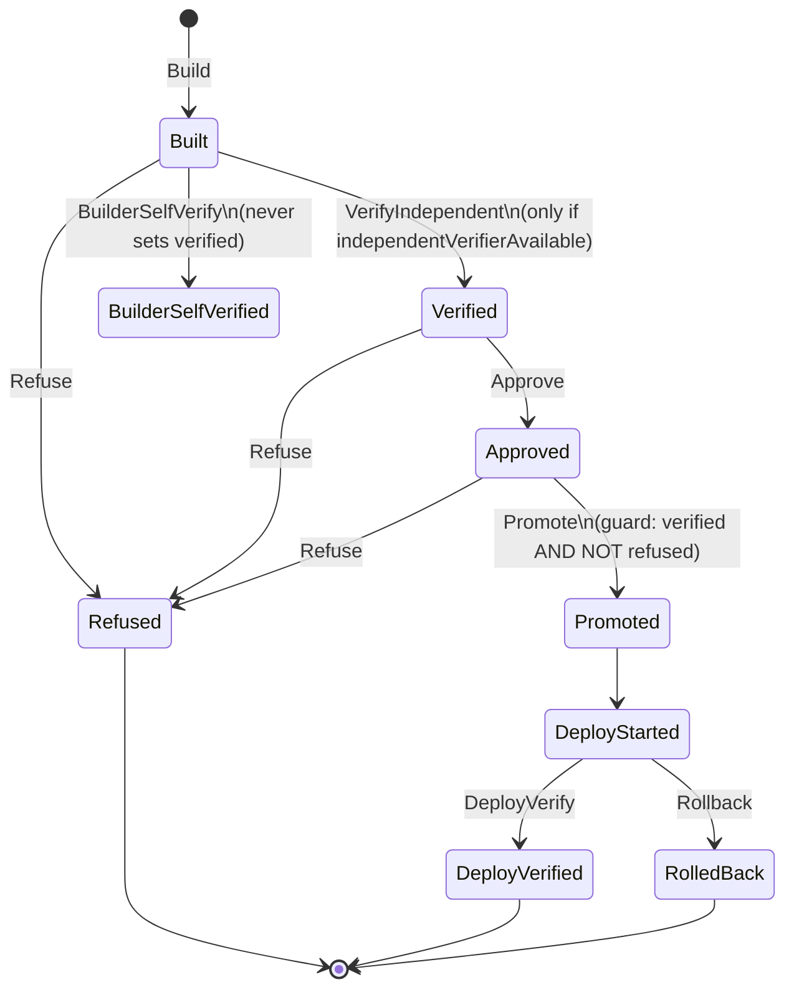

# Formal Methods

IBE's two most safety-critical state machines — the **capability lifecycle** and the
**promotion lifecycle** — are specified in TLA+ and checked by an equivalent
explicit-state model checker written in TypeScript. The TLA+ specifications are the
**authoritative** artifacts; the TypeScript checker is the **CI gate** (`npm run formal`).

| Artifact | Role | Status |
|---|---|---|
| `formal/tla/Capability.tla` + `.cfg` | Authoritative capability spec | Implemented (authoritative) |
| `formal/tla/Promotion.tla` + `.cfg` | Authoritative promotion spec | Implemented (authoritative) |
| `packages/formal/*` | TypeScript explicit-state mirror | Implemented (CI gate) |
| TLC model checker (`tla2tools.jar`) | Runs the TLA+ specs | **Not vendored** — optional/manual |

**Why the TS checker is the gate:** `formal/run-tlc.sh` deliberately does **not** vendor
`tla2tools.jar`. If the jar is absent it prints how to obtain it (`curl -L -o
tla2tools.jar https://github.com/tlaplus/tlaplus/releases/latest/download/tla2tools.jar`)
and **exits 0**, so CI relies on the equivalent TypeScript checker instead of requiring a
Java/TLC install. Run the real TLA+ specs manually by placing the jar and running
`bash formal/run-tlc.sh`.

## The explicit-state checker

`packages/formal/transition-system.ts` is a tiny BFS-over-reachable-states model checker:

- `TransitionSystem<S>` — `{ name, initial: S[], next(state), key(state), invariants: Invariant<S>[], terminalInvariants?: Invariant<S>[] }`.
- `Invariant<S>` — `{ name, holds(state): boolean }`.
- `checkModel(ts, maxStates = 100_000)` — BFS deduping via `key`, checks every
  `invariant` on each state, and checks `terminalInvariants` only on terminal states
  (states with no successors — a liveness/recovery proxy). Returns
  `ModelCheckResult { model, statesExplored, ok, violations }`.

`packages/formal/check.ts` drives four runs via `runFormalChecks()`:

| Model | Expected |
|---|---|
| `capabilitySystem(false)` (correct) | `safe` (no violations) |
| `capabilitySystem(true)` (broken) | `unsafe-caught` (violation found) |
| `promotionSystem(false)` (correct) | `safe` |
| `promotionSystem(true)` (broken) | `unsafe-caught` |

The gate passes iff every correct model has **zero** violations **and** every broken
model **is caught** (`pass = expected === 'safe' ? result.ok : !result.ok`). A broken
model that produced no violation would fail the gate — this proves the checker actually
has teeth. `FormalReport.ok = results.every(r => r.pass)`.

CI command: `npm run formal` → `node dist/packages/cli/index.js formal check`. It is also
part of `npm run verify:acceptance`.

## Capability spec

`formal/tla/Capability.tla` (authoritative) and `packages/formal/capability-spec.ts` (mirror).

State variables: `issued, revoked, expired, uses, usedWhileInvalid, singleUse,
boundToIntent, issuedByBuilder`. Actions: `Issue`, `Consume` (guarded by
`ValidNow == ~revoked /\ ~expired` and `WithinLimit == ~singleUse \/ uses < 1`),
`Revoke`, `Expire`. Bounded by `MaxUses = 2`.

**Named invariants (verbatim from `Capability.cfg`):**

| Invariant | Meaning |
|---|---|
| `Inv_NoUseWhileInvalid` (`usedWhileInvalid = FALSE`) | A revoked or expired capability is never used |
| `Inv_SingleUse` (`singleUse => uses <= 1`) | A single-use capability is never used twice |
| `Inv_BoundToIntent` (`issued => boundToIntent`) | An issued capability is always bound to its intent |
| `Inv_NotBuilderIssued` (`issued => ~issuedByBuilder`) | A builder never issues its own capability |

The **broken** model (`capabilitySystem(true)`, hazard H-5) removes the use-time
validity guard, making a `usedWhileInvalid = TRUE` state reachable — which the checker
catches.

## Promotion spec

`formal/tla/Promotion.tla` (authoritative) and `packages/formal/promotion-spec.ts` (mirror).
`Promote` is guarded by `~promoted /\ approved /\ verified /\ ~refused`. `BuilderSelfVerify`
sets `builderSelfVerified` but never `verified`. Liveness uses weak fairness on
`DeployVerify \/ Rollback`.

**Named invariants + property (verbatim from `Promotion.cfg`):**

| Property | Meaning |
|---|---|
| `Inv_NoPromoteBeforeVerify` (`promoted => verified`) | No promotion before independent verification |
| `Inv_RefusedNeverPromoted` (`~(promoted /\ refused)`) | A refused change is never promoted |
| `Inv_BuilderNotSelfVerified` (`(builderSelfVerified /\ ~independentVerifierAvailable) => ~verified`) | Builder self-verification alone never counts as verified |
| `Recovery` (`deployStarted ~> (deployVerified \/ rolledBack)`) | Every started deployment eventually reaches a verified state or a rollback (leads-to liveness) |

The **broken** model (`promotionSystem(true)`, hazard H-3) drops the "verified before
promote" guard, making a promoted-without-verification state reachable — which the checker catches.
