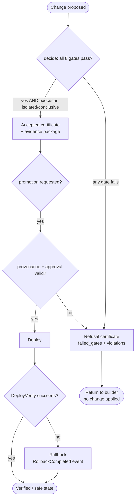

# Threat Model

IBE is itself a safety-critical controller: if *it* fails, unsafe AI-generated changes get
promoted. So IBE ships its own STPA hazard model of the assurance kernel and derives
concrete, enforced controls from it. It also hardens every untrusted input surface.

Source: `packages/hazards/ibe-self.ts` (the model), `registry.ts` (schema),
`derive.ts` (derivation), plus the defenses in `packages/shared/*` and elsewhere.

## The 8 IBE self-hazards

The STPA model (`ibe-assurance-kernel-stpa`) defines four losses (L-1 unsafe change
reaches production; L-2 CUI disclosure; L-3 acceptance without valid evidence; L-4 no
recovery to safe state), and eight hazards, each linked to an Unsafe Control Action (UCA),
a Safety Constraint (SC-x), and derived enforcement. `deriveControls()` mechanically turns
each SC's `derives` block into the policy names, invariants, event patterns, and
verification-case ids the kernel enforces.

| Hazard | Constraint SC-x | Derived control(s) | Enforced in code |
|---|---|---|---|
| **H-1** Builder modifies production without valid approval | SC-1: production changes require a causally-prior recorded human approval | policy `policy.promotion.requires_human_approval`; forbidden `ProductionChangeWithoutApproval`; case `VER-PROMOTE-APPROVAL` | `causal/patterns.ts` (`FORBIDDEN_CATALOG`), `policy/rules.ts` (`authority.required_approvals`) |
| **H-2** Builder gets broader authority than the intent | SC-2: issued capabilities must be a subset of intent authority | policy `policy.capability.subset_of_intent`; forbidden `CapabilityExceedsIntent`; case `VER-CAP-SUBSET` | `capabilities/broker.ts` (`issue` bindings), `policy/rules.ts` (`authority.action_permitted`) |
| **H-3** Deployment promoted before independent verification | SC-3: promotion must be causally preceded by passing independent verification | policy `policy.promotion.requires_verification`; required `IntentAuthorized->VerificationPassed->AssuranceCertificateIssued`; forbidden `PromotionBeforeVerification`; case `VER-PROMOTE-ORDER` | `assurance/kernel.ts` (gate ordering), `formal/tla/Promotion.tla` (`Inv_NoPromoteBeforeVerify`) |
| **H-4** Certificate issued with missing evidence | SC-4: no certificate unless all intent-required evidence is present and fresh | policy `policy.evidence.completeness`; invariant `INV-EVIDENCE-COMPLETE`; case `VER-EVIDENCE-COMPLETE` | `assurance/kernel.ts` (`evidence-complete` gate), `verification/plugins.ts` (`EvidenceCompletenessVerifier`) |
| **H-5** Revoked/expired capability remains usable | SC-5: a revoked or expired capability must be rejected at use time | policy `policy.capability.valid_at_use`; invariant `INV-CAP-VALID`; forbidden `RevokedCapabilityUsed`; case `VER-CAP-LIFECYCLE` | `capabilities/broker.ts` (`validate`/`use`), `formal/tla/Capability.tla` (`Inv_NoUseWhileInvalid`) |
| **H-6** Model change silently invalidates prior evidence | SC-6: evidence tied to a model element must be invalidated when it changes | policy `policy.evidence.freshness`; invariant `INV-EVIDENCE-FRESH`; case `VER-EVIDENCE-FRESH` | `provenance/evidence.ts` (`evidenceStaleReasons`, `DEFAULT_INVALIDATION`), `model/delta.ts` (`deltaHash`) |
| **H-7** Failed deployment never reaches rollback/safe state | SC-7: a started deployment must eventually reach verified or rolled-back/safe | policy `policy.resilience.recovery_required`; required `DeploymentStarted~>(DeploymentVerified\|RollbackCompleted)`; case `VER-RECOVERY` | `causal/patterns.ts` (recovery obligation), `assurance/kernel.ts` (`recoverable` gate), `formal/tla/Promotion.tla` (`Recovery`) |
| **H-8** Builder modifies the policy that judges its own change | SC-8: a builder cannot modify the policy bundle or evidence-generation code for its own change | policy `policy.scope.no_self_governance_edit`; forbidden `BuilderModifiedOwnPolicy`; case `VER-NO-SELF-GOVERNANCE` | `adapters/scope.ts` (`PROTECTED_GLOBS`), `policy/rules.ts` (`authority.no_self_approval`) |

Mitigations tie back to the constraints: `M-1` deterministic gate ordering (SC-3), `M-2`
capability subset check at issue and use (SC-2, SC-5), `M-3` evidence freshness
invalidation keyed on hashes (SC-4, SC-6), `M-4` protected-path scope rule (SC-8).

## Attacker input classes & defenses

Every intent file, model file, policy bundle, event trace, and evidence object is
untrusted input. The defenses are centralized (mostly in `packages/shared/`) and named:

| Attack class | Defense | File |
|---|---|---|
| **Path traversal / absolute-path escape** | `resolveWithin` rejects `..` segments and absolute escapes (`MALFORMED_INPUT`) | `shared/fs-safe.ts` |
| **Symlink escape** | Symlinks refused via `lstat` (not `stat`); `allowSymlinks` defaults false; workspace copy uses `dereference:false` + symlink filter | `shared/fs-safe.ts`, `execution/workspace.ts` |
| **Oversized input / DoS** | `DEFAULT_MAX_BYTES = 5 MiB` cap before parsing; captured process output capped at 2 MiB | `shared/fs-safe.ts`, `execution/local-runner.ts` |
| **YAML bomb ("billion laughs")** | YAML parsed with bounded `maxAliasCount: 100` | `shared/fs-safe.ts` |
| **Prototype pollution** | `__proto__`/`constructor`/`prototype` stripped on parse and dropped during canonicalization; `.strict()` schemas reject unknown keys | `shared/fs-safe.ts`, `shared/canonical.ts`, `intent/contract.ts` |
| **Replay** | Single-use capabilities cannot be consumed twice (`consumed` set → `CAPABILITY_REPLAY`); anti-replay `nonce` | `capabilities/broker.ts` |
| **Signature confusion** | Pure EdDSA (`null` algorithm) over a single canonical byte form; no third-party crypto; non-finite/undefined rejected | `identity/keys.ts`, `shared/canonical.ts` |
| **Log injection** | Control characters escaped to `\xNN`; strings truncated at 512 chars; secret-keyed values redacted to `«redacted»` | `shared/logging.ts` |
| **Non-determinism in the decision** | Canonical JSON (sorted keys), rejection of NaN/Infinity, deterministic rule order + bundle hash | `shared/canonical.ts`, `policy/engine.ts` |
| **Stale evidence reuse** | Context-bound freshness/invalidation triggers | `provenance/evidence.ts` |

All failures are surfaced as structured `Reason` codes (`packages/shared/errors.ts`) — a
factual, serializable, secret-free reason — rather than free-form concatenated log lines.

## Failure and rollback flow

The recovery obligation `DeploymentStarted~>(DeploymentVerified|RollbackCompleted)` (SC-7)
is what forces a started deployment to reach either verification or rollback; a trace that
starts a deployment and does neither fails the `causally-valid` / `recoverable` gates.
