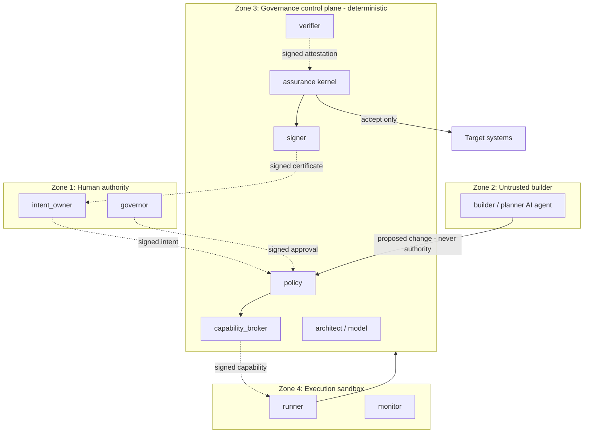

# Trust Boundaries & Separation of Roles

IBE enforces separation of duties at the type level: authority is a role plus a
capability, and no single actor holds enough authority to both build a change and bless
it. The central rule:

> **The builder can never issue its own capability, self-approve, modify the policy that
> judges it, or mark itself verified.**

Source: `packages/identity/provider.ts` (roles), `packages/capabilities/broker.ts`,
`packages/policy/rules.ts`, `packages/adapters/scope.ts` (protected paths), and the TLA+
specs in `formal/tla`.

## Roles

`ActorRole` (`identity/provider.ts`) — the eleven roles:

| Role | Responsibility | May sign / decide? |
|---|---|---|
| `intent_owner` | Declares the human intent | Signs the intent |
| `architect` | Owns the system model | — |
| `planner` | Produces the proposed change/plan | — |
| `builder` | Generates code / infra (AI agent) | **Never** governs its own work |
| `policy` | Owns the policy bundle | — |
| `capability_broker` | Issues least-privilege capabilities | Signs capabilities |
| `runner` | Executes under a capability | — |
| `verifier` | Independent verification | Signs verifier attestations |
| `governor` | Approves gated actions | Records approvals |
| `signer` | Issues the assurance certificate | Signs certificates |
| `monitor` | Observes runtime | — |

`LocalIdentityProvider` is the development identity authority: every actor holds a role set
and an Ed25519 keypair; `hasRole`, `signer(id)`, and `verify(id, …)` enforce that only
key-holding actors of the right role can sign. A verification-only actor
(`registerPublicKey`) has no private key and cannot sign at all.

> **SPIFFE/SPIRE is a planned seam, not implemented.** `WorkloadIdentityProvider` is an
> interface (one method, `fetchSvid()`) documenting the production workload-identity
> contract; the MVP uses `LocalIdentityProvider`.

## Why the builder cannot self-govern

The rule is enforced redundantly at four independent layers, so bypassing any one still
fails closed:

| Layer | Enforcement |
|---|---|
| **Capability broker** | `issue()` returns `SELF_APPROVAL` if the subject holds `builder` and is the broker itself, or if the broker tries to issue to itself; issuer must hold `capability_broker` else `UNAUTHORIZED` |
| **Policy engine** | `authority.no_self_approval` denies `policy.modify` / `production.promote` when `actorId === builderId`; `authority.action_permitted` denies `self_approve` outright |
| **Scope enforcement** | `PROTECTED_GLOBS` (`packages/policy/**`, `packages/assurance/**`, `packages/provenance/**`, `packages/capabilities/**`, `policies/**`, `formal/**`, `.github/**`) — a builder change touching governance code without authorization is a `POLICY_DENIED` violation ("the builder cannot edit what judges it") |
| **Intent completeness** | `authority.prohibited_actions` MUST include `self_approve` or the intent is rejected (`INTENT_INCOMPLETE`) — the doctrine rule |
| **Formal proof** | `Inv_NotBuilderIssued` (Capability.tla) and `Inv_BuilderNotSelfVerified` (Promotion.tla) prove it over all reachable states |

Verification independence is enforced separately: `VerifierRegistry` counts only results
that both **passed** and are **independent of the builder** (`independentOf(builderId)`);
platform verifiers are independent by construction. `checkIndependence` refuses
(`VERIFIER_NOT_INDEPENDENT`) if fewer than `minimum_independent_verifiers` independent
passes exist.

## Signatures crossing boundaries

Every trust-boundary crossing is a signed artifact verified by the receiving zone:

- **Intent** → signed by `intent_owner`, hashed into every downstream capability and certificate.
- **Capability** → signed by `capability_broker`; validated at use time (signature,
  expiry, revocation, single-use, bindings).
- **Evidence** → signed by its collector; integrity-hash + signature checked.
- **Attestation** → Ed25519 identity-bound signature over the provenance predicate.
- **Certificate** → signed by `signer`; `verifyCertificate` re-checks signature +
  self-consistency.

## Trust zones

The builder (Zone 2) is treated as untrusted: its output is a proposal that Zone 3 (the
deterministic control plane) may refuse. The builder never has a key or role that lets it
issue capabilities, approve, modify policy, or self-verify — those live only in Zone 1
(humans) and Zone 3 (governance).
